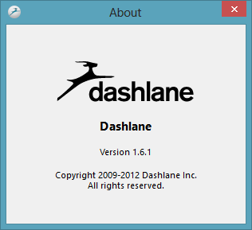
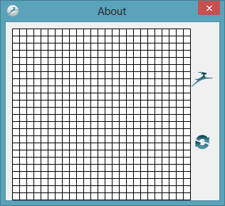
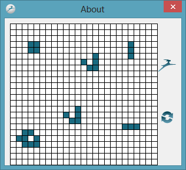
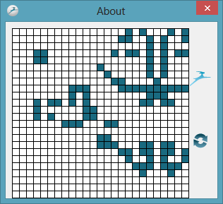
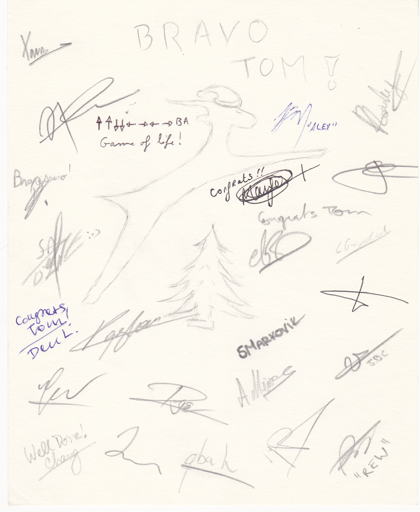

I've been a [Dashlane](https://www.dashlane.com/) user for a while now, having found out about it through a friend and respected colleague who started working for them in the Paris office.

What you may not know is that Dashlane have invited a number of people to be on their "Board of Users" and to give feedback on new product developments. A few days ago one of the QA Engineers set us all a challenge - to find a hidden "cheat code" in the PC version of the application.

Well, I found it! (and I think I was the first)

It turns out that if you open the application, then go to the _Help_ > _About_ screen you'll initially see this:

Now comes the fun part, you need to type the [Konami Code](http://en.wikipedia.org/wiki/Konami_Code):

↑ ↑ ↓ ↓ ← → ← → B A

As soon as you finish that, you'll see this screen and the [Easter Egg](<http://en.wikipedia.org/wiki/Easter_egg_(media)>) will have been activated:

Initially I though, hmm, interesting, is it some kind of icon editor? You can start drawing on the grid, like this:

But as soon as you click the Dashlane logo then the grid turns into Conway's Game of Life:

The guys at Dashlane have been kind enough to offer to send me some goodies but the main prize is this signed Dashlane drawing from the team at Dashlane in Paris:

Thanks all!
