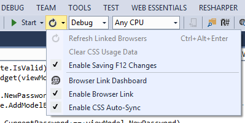

# Sluggish Internet Explorer performance and Browser Link

I recently experienced problems where Internet Explorer performance was sluggish, almost unusable. I could barely log in to the application I was running as there was a long lag between key presses and the text appearing. It turns out that the culprit was Browser Link, a new feature in Visual Studio 2013 that creates a communication channel between the development environment and one or more web browsers.

Disabling Browser Link solved the performance problems.

Uncheck the "Enable Browser Link" option:

